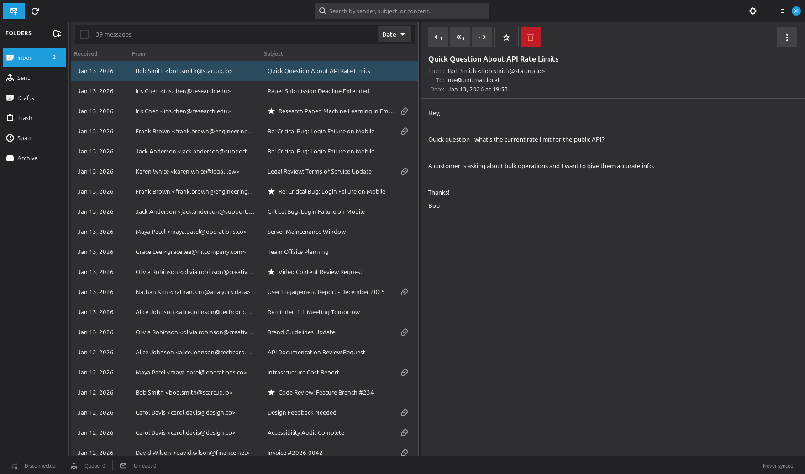

# unitMail

**Take Back Your Email. Own Your Communications.**

unitMail is an independent, self-hosted email system that gives you complete control over your email infrastructure. No more relying on Gmail, Outlook, or other cloud providers who can lock you out at any moment.



---

## The Problem with Conventional Webmail

### You Don't Own Your Email

When you use Gmail, Outlook, Yahoo, or any cloud email provider, you're not a customer—you're the product. Your emails are:

- **Scanned and analyzed** for advertising purposes
- **Stored on servers you don't control** in jurisdictions you may not trust
- **Subject to terms of service** that can change without notice
- **Vulnerable to account suspension** with little or no recourse

### Real-World Consequences

**Account Lockouts Happen:**
- Google suspends accounts for "suspicious activity" with no explanation
- Microsoft locks accounts requiring phone verification you may not have
- Yahoo has suffered massive data breaches exposing billions of accounts
- Anthropic, universities, and businesses have had critical emails blocked by overzealous spam filters

**When your email provider locks you out:**
- You lose access to password resets for every online account
- Business communications are cut off instantly
- Years of correspondence vanish
- There's often no human to appeal to

### The Centralization Problem

A handful of companies control email for billions of people:
- Gmail: 1.8 billion users
- Outlook: 400 million users
- Yahoo: 225 million users

This concentration creates:
- **Single points of failure** - One outage affects millions
- **Surveillance risks** - Easy targets for government data requests
- **Vendor lock-in** - Switching costs are enormous
- **Power imbalance** - Users have no leverage

---

## The unitMail Solution

### True Email Independence

unitMail provides a complete, self-contained email system where **you own everything**:

| What You Control | How unitMail Delivers |
|------------------|----------------------|
| Your Data | All email stored locally in encrypted SQLite database |
| Your Server | Bundled gateway microservice runs on your hardware or VPS |
| Your Identity | Your domain, your DNS, your reputation |
| Your Privacy | No scanning, no ads, no data mining |
| Your Access | No one can lock you out of your own system |

### How unitMail Works

```
┌─────────────────────────────────────────────────────────────┐
│                    Your Local System                         │
│  ┌──────────────────┐          ┌──────────────────┐         │
│  │   GTK Client     │◄────────►│ Gateway Service  │         │
│  │   (Your UI)      │  Local   │   (Your Server)  │         │
│  │                  │  Socket  │                  │         │
│  │  - Compose       │          │  - SMTP Server   │         │
│  │  - Read          │          │  - Queue Manager │         │
│  │  - Search        │          │  - DKIM Signing  │         │
│  └────────┬─────────┘          └─────────┬────────┘         │
│           │                               │                  │
│           └───────────┬───────────────────┘                  │
│                       ▼                                      │
│           ┌──────────────────────┐                          │
│           │  Encrypted Database  │                          │
│           │  (SQLite + Supabase) │                          │
│           └──────────────────────┘                          │
└────────────────────────┬────────────────────────────────────┘
                         │
                         │ TLS Encrypted (Port 25/587)
                         ▼
              ┌──────────────────────┐
              │ Internet Email       │
              │ (Gmail, Outlook, etc)│
              └──────────────────────┘
```

**The Flow:**

1. **Compose** - Write email in the GTK desktop client
2. **Queue** - Message queued locally with DKIM signature
3. **Send** - Gateway delivers via SMTP to recipient's server
4. **Receive** - Incoming mail received by your gateway on port 25
5. **Store** - All mail encrypted and stored in your local database
6. **Read** - Access your email anytime, even offline

### Why It Works

**Standards-Based Compatibility:**
- Full SMTP/IMAP protocol support
- Works with any email address (Gmail, Outlook, etc.)
- SPF, DKIM, DMARC authentication
- TLS encryption for all connections

**Hybrid Architecture:**
- Local storage = Data sovereignty
- VPS gateway = Port 25 access (bypasses ISP blocks)
- Optional mesh network = Direct peer-to-peer email

**No Vendor Lock-in:**
- Open source (LGPL)
- Standard protocols
- Exportable data (mbox format)
- Can migrate between VPS providers

---

## Why Linux?

unitMail is built exclusively for Linux, and here's why:

### Technical Advantages

**Native Integration:**
- GTK 4 provides native look and feel
- systemd for reliable service management
- D-Bus for desktop notifications
- Kernel keyring for secure credential storage

**Server Capabilities:**
- Linux dominates the server market (96%+ of web servers)
- Best-in-class networking stack
- Postfix/SMTP ecosystem is Linux-native
- WireGuard VPN is a kernel module

**Security Model:**
- Fine-grained permissions (AppArmor, SELinux)
- Process isolation
- Transparent, auditable source code
- No telemetry or forced updates

### Philosophical Alignment

**Open Source Ethos:**
Linux users already understand:
- The value of controlling your own systems
- Why open source matters for trust
- How to self-host services
- The importance of digital sovereignty

**Target Audience:**
unitMail is built for people who:
- Run their own servers
- Care about privacy
- Want to understand their tools
- Value independence over convenience

**Not For Everyone:**
We're explicit: if you want zero-effort email, use Gmail. If you want **ownership**, use unitMail.

---

## Features

### Core Functionality
- **Email Composition** - Rich text editor with attachments (25MB per file)
- **Folder Management** - Inbox, Sent, Drafts, Trash + custom folders
- **Contact Management** - Address book with PGP key storage
- **Search** - Full-text search across all messages
- **Queue Monitoring** - See delivery status in real-time

### Security
- **Transport Encryption** - TLS 1.2+ for all connections
- **Storage Encryption** - SQLCipher encrypted database
- **PGP Support** - End-to-end encryption (optional)
- **DKIM/SPF/DMARC** - Automatic email authentication

### Advanced
- **Mesh Networking** - Direct peer-to-peer via WireGuard
- **Multiple Deployment Models** - Self-host, VPS, or hybrid
- **Backup/Restore** - One-click backup with encryption
- **API Access** - REST API for automation

---

## System Requirements

### Client (Your Desktop)
- **OS:** Ubuntu 22.04+, Debian 12+, Fedora 38+, Arch Linux
- **CPU:** x86_64 or ARM64, 1 GHz+
- **RAM:** 1GB minimum, 2GB recommended
- **Disk:** 5GB + space for email storage
- **Dependencies:** Python 3.11+, GTK 4.0+

### Gateway (VPS or Self-Hosted)
- **OS:** Ubuntu Server 22.04 LTS recommended
- **CPU:** 1 vCPU minimum
- **RAM:** 1GB minimum
- **Disk:** 10GB SSD
- **Network:** Static IPv4, Port 25 open
- **Cost:** ~$5/month on Vultr, DigitalOcean, or Linode

---

## Quick Start

### Installation

```bash
# Clone the repository
git clone https://github.com/mikesdatawork/unitmail.git
cd unitmail

# Create virtual environment
python3.11 -m venv venv
source venv/bin/activate

# Install dependencies
pip install -e ".[dev]"

# Run database migrations
python scripts/migrate.py up

# Start the gateway
python scripts/run_gateway.py --port 5000
```

### Configuration

Copy the example configuration:
```bash
cp config/settings.example.toml config/settings.toml
```

Set your Supabase credentials:
```toml
[database]
supabase_url = "https://your-project.supabase.co"
supabase_key = "your-anon-key"
```

### Running Tests

```bash
# Unit tests
pytest tests/unit

# E2E tests with Playwright
pytest tests/e2e

# All tests with coverage
pytest --cov=src --cov-report=html
```

---

## Project Structure

```
unitmail/
├── docs/                 # Documentation
│   ├── ARCHITECTURE.md
│   ├── REQUIREMENTS.md
│   └── TECHNICAL_SPECIFICATION.md
├── src/
│   ├── client/          # GTK desktop application
│   │   ├── ui/          # UI components
│   │   ├── models/      # Data models
│   │   └── services/    # Business logic
│   ├── gateway/         # Gateway microservice
│   │   ├── smtp/        # SMTP handling
│   │   ├── api/         # REST API
│   │   └── crypto/      # Encryption
│   └── common/          # Shared code
├── tests/
│   ├── e2e/             # Playwright E2E tests
│   └── unit/            # pytest unit tests
├── database/
│   ├── migrations/      # Supabase migrations
│   └── seeds/           # Test data
├── config/              # Configuration templates
├── scripts/             # CLI tools
└── skills/              # Implementation documentation
```

---

## Deployment Models

### 1. VPS Gateway (Recommended)
Best for most users. Your desktop client talks to a $5/month VPS that handles SMTP.

```
Home Desktop ◄──HTTPS──► VPS Gateway ◄──SMTP──► Internet
     │                        │
     └── Email stored locally  └── No email stored
```

### 2. Self-Hosted (Business Internet)
For users with static IP and port 25 access.

```
Home Server (Static IP)
     │
     ├── GTK Client
     ├── Gateway Service
     └── Email Database
```

### 3. Mesh Network
For groups wanting private, direct communication.

```
User A ◄──WireGuard──► User B ◄──WireGuard──► User C
  │                      │                      │
  └── All communication encrypted, no internet required
```

---

## Cost Comparison

| Solution | Monthly Cost | You Own Your Data? | Can Be Locked Out? |
|----------|-------------|-------------------|-------------------|
| Gmail | $0 | No | Yes |
| Google Workspace | $6+ | No | Yes |
| ProtonMail | $4+ | Partially | Yes |
| Self-hosted Postfix | $5+ VPS | Yes | No (but complex) |
| **unitMail** | **$5 VPS** | **Yes** | **No** |

**Total Cost of Ownership:**
- Domain: ~$12/year
- VPS: ~$60/year
- **Total: ~$72/year** for complete email independence

---

## Roadmap

### Phase 1: MVP (Current)
- [x] GTK desktop client
- [x] Gateway microservice
- [x] Supabase database integration
- [x] Basic send/receive
- [ ] Playwright E2E tests
- [ ] First-run wizard

### Phase 2: Enhanced Features
- [ ] End-to-end PGP encryption
- [ ] WireGuard mesh networking
- [ ] Mobile clients (Android/iOS)
- [ ] Backup/restore tools

### Phase 3: Ecosystem
- [ ] Plugin architecture
- [ ] Multiple gateway providers
- [ ] Community contributions
- [ ] Migration tools (Gmail import)

---

## Contributing

We welcome contributions! Please read our development methodology in `docs/DEVELOPMENT_METHODOLOGY.md`.

```bash
# Fork and clone
git clone https://github.com/YOUR_USERNAME/unitmail.git

# Create feature branch
git checkout -b feature/your-feature

# Make changes and test
pytest
black src/
flake8 src/

# Submit pull request
```

---

## FAQ

**Q: Can I still email Gmail/Outlook users?**
A: Yes! unitMail is fully compatible with all standard email providers.

**Q: Do I need technical expertise?**
A: Basic Linux command-line knowledge is required. If you can `ssh` into a server and run commands, you can use unitMail.

**Q: What if my VPS provider blocks port 25?**
A: Most providers (Vultr, Linode, DigitalOcean) allow port 25 for legitimate use. Some require a support ticket.

**Q: Is my email private?**
A: Your email is stored encrypted on your local machine. The VPS gateway only relays messages—it never stores them.

**Q: What about spam filtering?**
A: unitMail includes Rspamd integration for spam scoring and filtering.

---

## License

unitMail is released under the GNU Lesser General Public License (LGPL).

- **Core:** Open source, free forever
- **Premium features:** Optional paid add-ons (planned)

---

## Support

- **Documentation:** [docs/](./docs/)
- **Issues:** [GitHub Issues](https://github.com/mikesdatawork/unitmail/issues)
- **Discussions:** [GitHub Discussions](https://github.com/mikesdatawork/unitmail/discussions)

---

## Acknowledgments

Built with:
- [Flask](https://flask.palletsprojects.com/) - Web framework
- [Supabase](https://supabase.com/) - Database backend
- [GTK 4](https://gtk.org/) - Desktop UI toolkit
- [Playwright](https://playwright.dev/) - E2E testing
- [Postfix](http://www.postfix.org/) - SMTP server

---

## AI Agent Development Team

unitMail was developed with the assistance of a multi-agent AI system powered by [Claude](https://claude.ai). Each specialized agent contributed to different aspects of the application:

| Agent | Role | Contributions |
|-------|------|---------------|
| **change-coordinator** | Meta-Orchestrator | Task routing, conflict resolution, work prioritization |
| **email-client-expert** | Email Features | Core email functionality, draft editing, multi-selection, click handling |
| **email-ui-expert** | UI/UX Design | Column alignment, context menus, accessibility, visual design |
| **db-email-integrator** | Database | Local storage system, schema design, sample data generation |
| **performance-engineer** | Optimization | Performance profiling, bottleneck detection |
| **security-auditor** | Security | Vulnerability assessment, OWASP compliance review |
| **test-automation** | Testing | Test infrastructure, coverage analysis, regression detection |
| **user-simulation** | UX Testing | Exploratory testing, user journey validation |
| **gateway-specialist** | Backend | SMTP/IMAP protocol integration |
| **ci-cd-specialist** | DevOps | Build pipelines, deployment automation |

### Agent Workflow

```
                    change-coordinator
                   (Meta-Orchestrator)
                          │
        ┌─────────────────┼─────────────────┐
        ▼                 ▼                 ▼
  email-client      email-ui         db-email
    -expert          -expert        -integrator
        │                 │                 │
        └─────────────────┼─────────────────┘
                          ▼
                  test-automation
                          │
                          ▼
                  user-simulation
```

The agent system follows a **modular design principle** where each component can be modified independently without affecting the overall system. All agents coordinate through the change-coordinator to ensure consistency and avoid conflicts.

---

**unitMail: Because your email should belong to you.**
